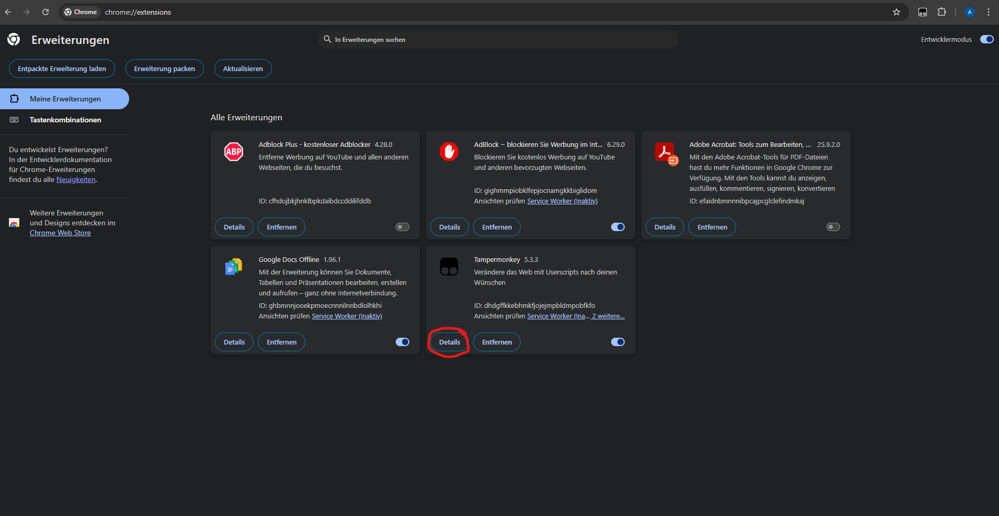
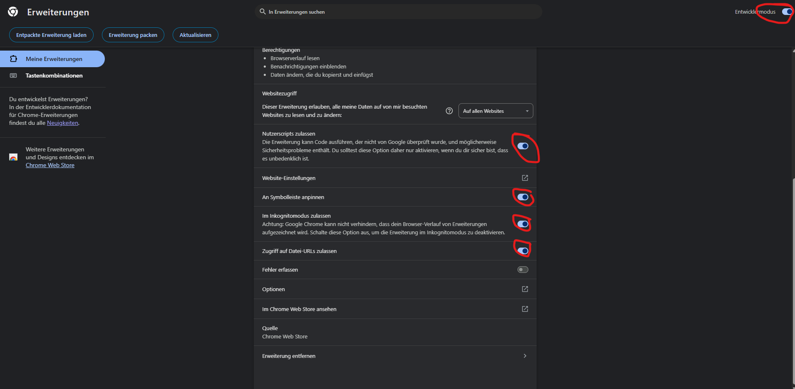
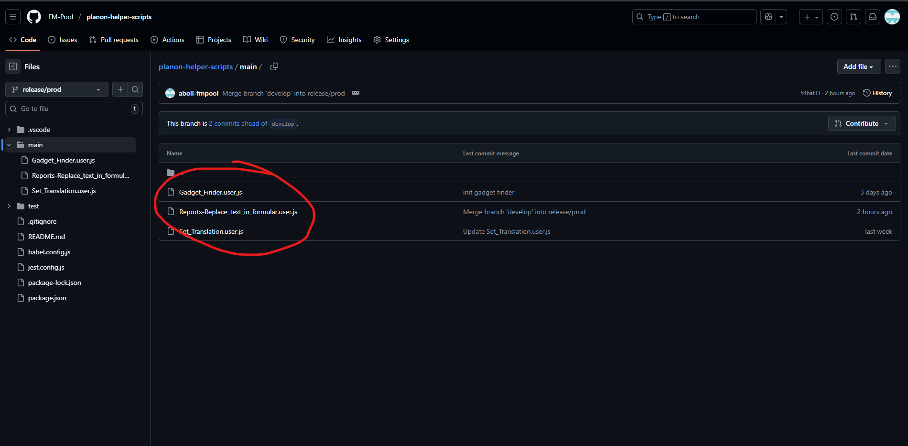
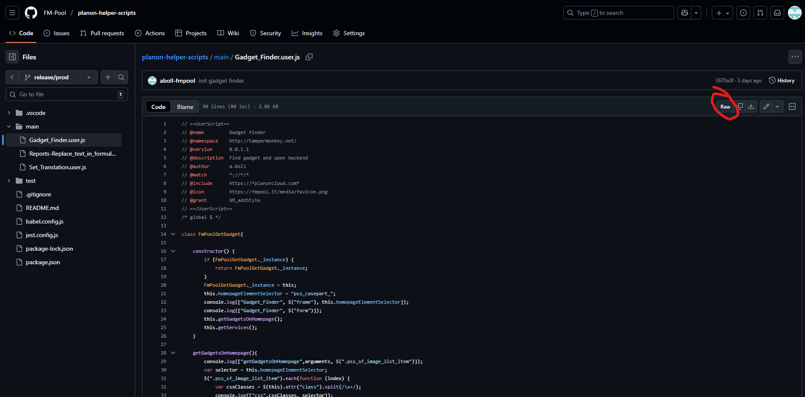
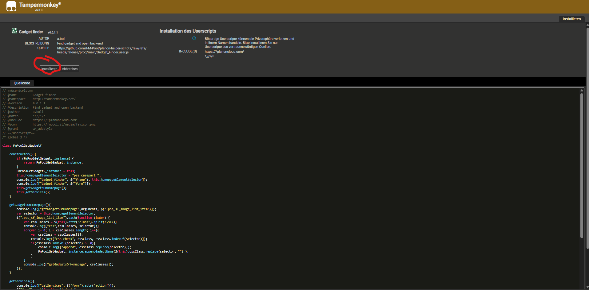
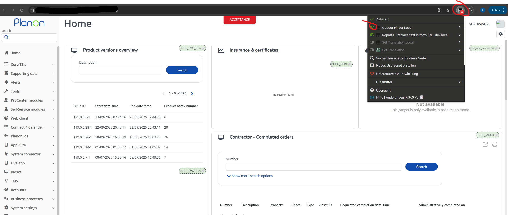

# Planon Helper Scripts

## Installation

### 1. Install tampermonkey
1. First install the tampermonkey add-on for your [browser](https://www.tampermonkey.net/). 
 - [Chrome store](https://chromewebstore.google.com/detail/dhdgffkkebhmkfjojejmpbldmpobfkfo?utm_source=item-share-cb)
 - [Firefox add-ons](https://addons.mozilla.org/en-US/firefox/addon/tampermonkey/)
2. Configure the tampermonkey plugin so that the scripts will be executed
 - In extesion tab (in chrome extension -> manage extensions) click on details
 
 - Allow tampermonkey to execute scripts by checking the following boxes
 

### 2. Install user scripts

The available user scripts are in the [main folder](https://github.com/FM-Pool/planon-helper-scripts/tree/release/prod/main). Please use the **release/prod** branch from the link. You needed to install the user scripts into your browser.

1. Choose one of the scripts and click on it:
  
2. Click on *Raw*
 
3. After this the tampermonkey extension recognize that there is a userscript and opens a dialog for installation. Just click *install*.
 

After installation you can turn the user script off and on in the tampermonkey extension.

## Development

### Local file development
https://stackoverflow.com/questions/41212558/develop-tampermonkey-scripts-in-a-real-ide-with-automatic-deployment-to-openuser

In tamper monkey use like this

'// @require      file://C:\dev/src/planon-helper-scripts/main/Set_Translation.user.js'
